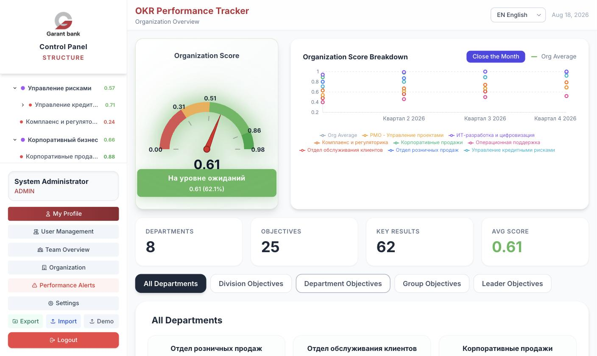
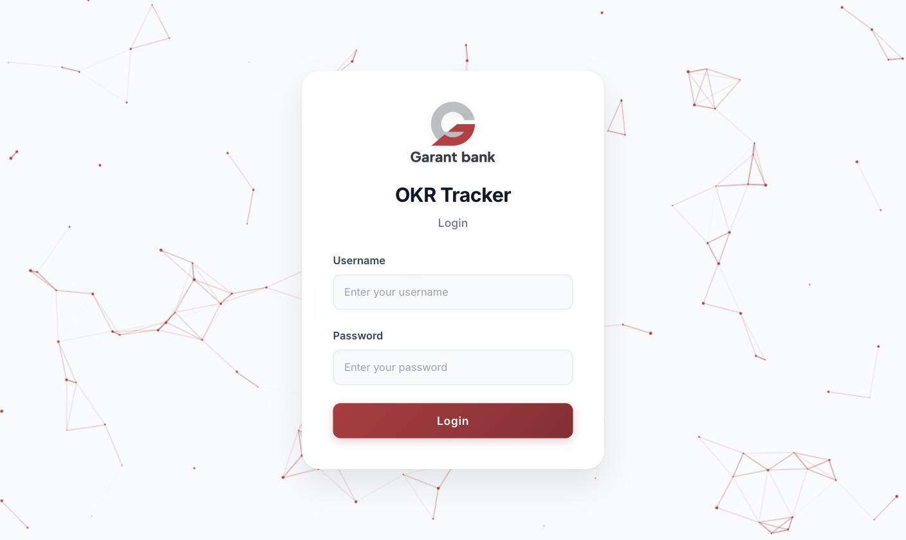
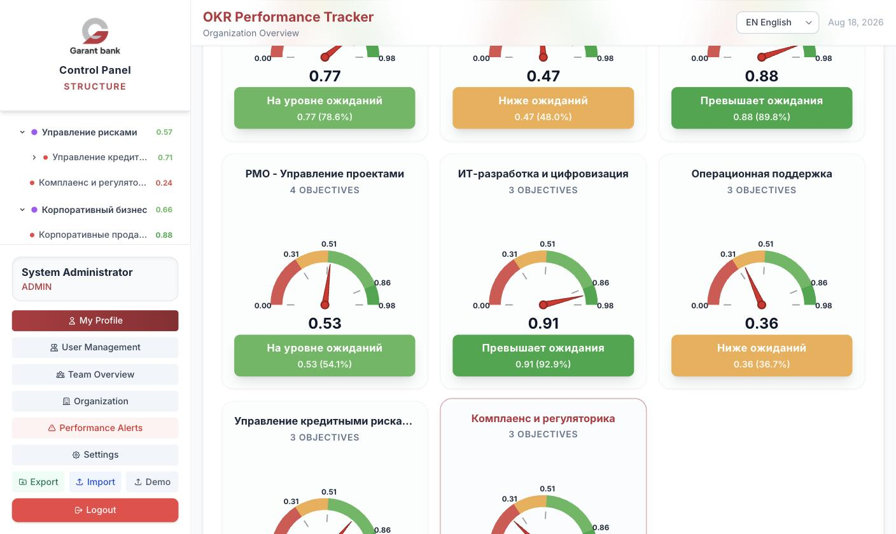
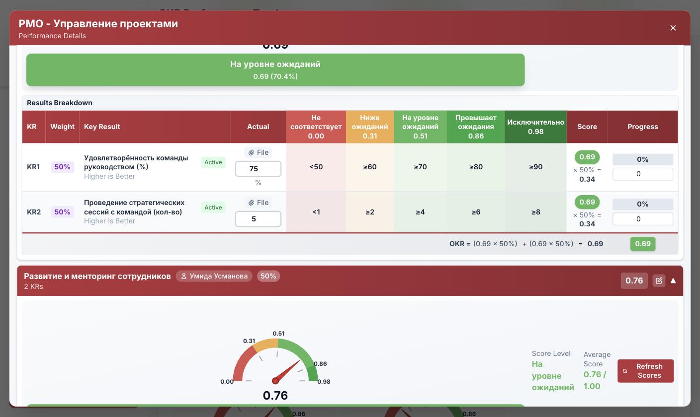
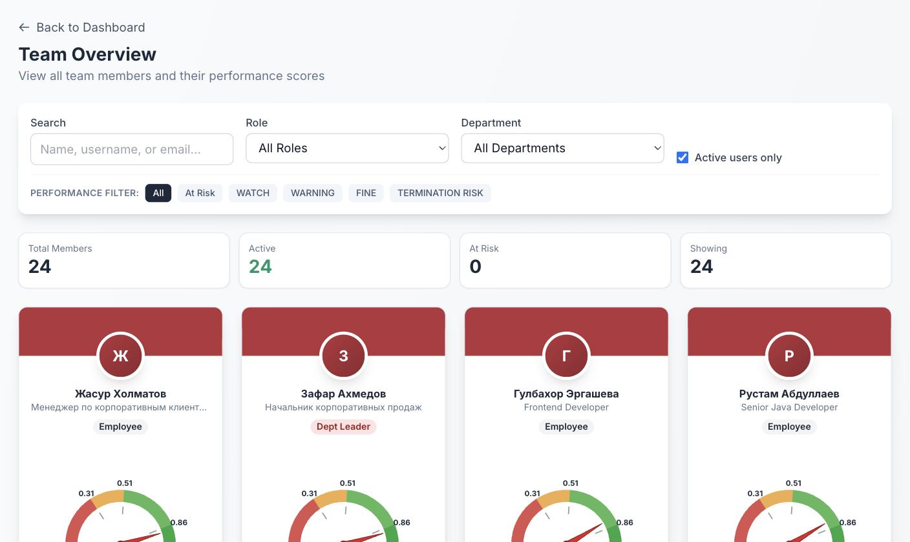
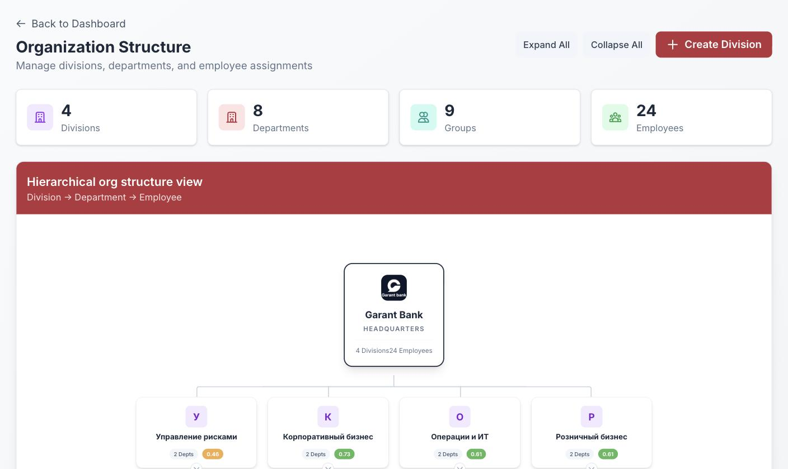
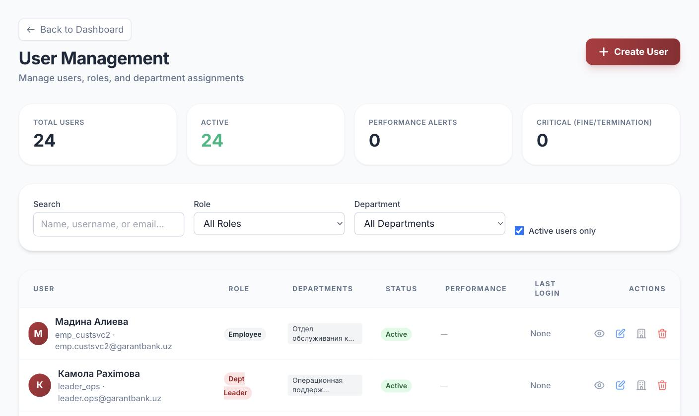
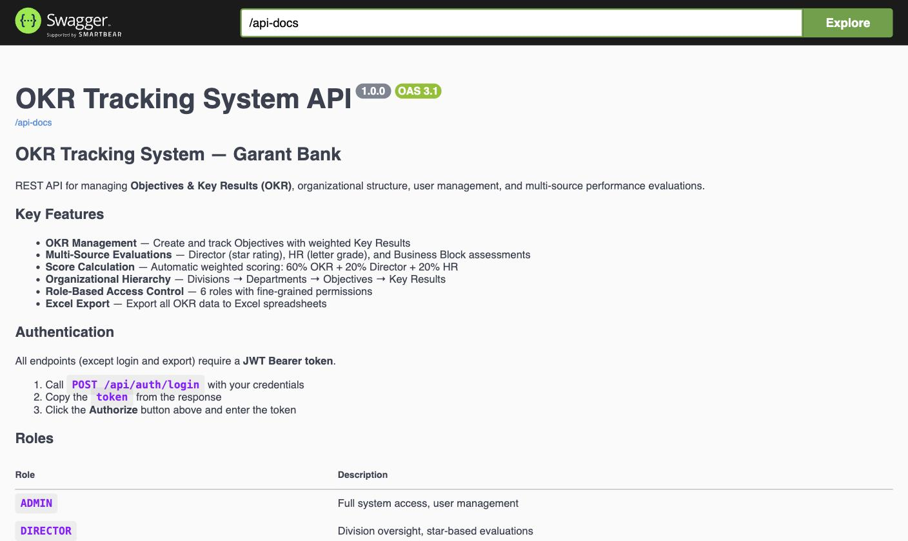

<div align="center">

# 🎯 Garant Bank — OKR Performance Tracker

**A full-stack platform for tracking Objectives & Key Results, organizational structure, and multi-source employee performance evaluations.**




</div>

---

## ✨ Features

- 🎯 **OKR Management** — divisions → departments → objectives → weighted key results, with automatic score roll-up at every level
- 📊 **Speedometer Dashboards** — live gauge visualizations for the organization, each division, department, and employee
- 🧮 **Transparent Scoring** — each key result is graded against configurable thresholds (`0.00 / 0.31 / 0.51 / 0.86 / 0.98`), and the math is shown right in the UI: `OKR = Σ (KR score × weight)`
- ⭐ **Multi-Source Evaluations** — final department score combines **60% automatic OKR score + 20% Director rating (1–5 ★) + 20% HR grade (A–D)**, with optional Business Block assessment
- 🏢 **Organization Structure** — interactive org chart (HQ → divisions → departments → employees) with groups and drag-free management modals
- 👥 **User Management & RBAC** — six roles with fine-grained permissions (see [RBAC matrix](okrTrackingSystem/RBAC.md))
- 🚨 **Performance Alerts** — automatic flagging of at-risk employees (Watch / Warning / Fine / Termination Risk)
- 📈 **Score History** — "Close the Month" snapshots build a quarter-by-quarter performance timeline
- 📎 **Proof Attachments** — optionally require a file as evidence when updating a key result's actual value
- 📤 **Excel Import / Export** — full OKR data round-trip as `.xlsx` (Apache POI)
- 🌍 **Trilingual UI** — English, Русский, O'zbekcha
- 🔐 **JWT Authentication** — stateless auth with Spring Security
- 📚 **OpenAPI Docs** — interactive Swagger UI out of the box

---

## 📸 Screenshots

### Login


### Department Scoreboards
Every department gets a speedometer with its current score and rating level.



### Key Results Breakdown
Weighted key results with threshold bands, actual values, proof attachments, and the exact score formula.



### Team Overview


### Organization Structure


### User Management


### API Documentation


---

## 🏗️ Tech Stack

| Layer | Technology |
|---|---|
| **Backend** | Java 17 · Spring Boot 4 · Spring Security (JWT) · Spring Data JPA · Hibernate |
| **Database** | H2 (file-based, for development) — swappable via JPA |
| **API Docs** | springdoc-openapi / Swagger UI |
| **Excel** | Apache POI |
| **Frontend** | React 19 · TypeScript · React Router 7 · Axios · Recharts |
| **Styling** | Tailwind CSS 3 |
| **Deployment** | Dockerfiles for backend and frontend (nginx) |

---

## 🚀 Getting Started

### Prerequisites

- **Java 17+**
- **Node.js 18+** and npm

### 1. Run the backend

```bash
cd okrTrackingSystem
./mvnw spring-boot:run
```

The API starts on **http://localhost:8080**. On first run it creates a file-based H2 database (`./data/okrdb`) and seeds a default administrator:

| Username | Password |
|---|---|
| `admin` | `admin123` |

> ⚠️ Change the default password and `jwt.secret` before any real deployment.

### 2. Run the frontend

```bash
cd frontend
npm install
npm start
```

The app opens on **http://localhost:3000** (API requests are proxied to `:8080`).

### 3. Load demo data

Log in as `admin` and press the **Demo** button in the sidebar — it creates sample divisions, departments, objectives, and key results so you can explore the system immediately.

### 🐳 Docker

Both services ship with Dockerfiles:

```bash
# Backend
cd okrTrackingSystem && docker build -t okr-backend .

# Frontend (nginx serving the production build)
cd frontend && docker build -t okr-frontend .
```

---

## 📚 API

Interactive documentation is available while the backend is running:

- **Swagger UI** — http://localhost:8080/swagger-ui.html
- **OpenAPI spec** — http://localhost:8080/api-docs (also exported as [`api-docs.yaml`](okrTrackingSystem/api-docs.yaml))
- **H2 console** — http://localhost:8080/h2-console

Highlights:

| Endpoint | Purpose |
|---|---|
| `POST /api/auth/login` | Obtain a JWT token |
| `GET /api/departments` | Departments with objectives & key results |
| `POST /api/departments/{id}/objectives` | Create an objective |
| `POST /api/objectives/{id}/key-results` | Add a weighted key result |
| `POST /api/evaluations` | Submit Director / HR / Business Block evaluations |
| `GET /api/export/excel` | Export all OKR data to Excel |
| `POST /api/import/excel` | Import OKR data from Excel |
| `POST /api/okr/score-history/snapshot` | Close the month (score snapshot) |
| `POST /api/demo/load` | Load demo data *(admin only)* |

---

## 🔐 Roles

| Role | Capabilities |
|---|---|
| `ADMIN` | Full system access, user management, settings |
| `DIRECTOR` | Star-based (1–5 ★) evaluations, division & department management |
| `HR` | Letter-grade (A–D) evaluations of departments and employees |
| `BUSINESS_BLOCK` | Numeric (1–5) department evaluations |
| `DEPARTMENT_LEADER` | Manages OKRs of assigned departments |
| `EMPLOYEE` | Read-only, or editing where explicitly granted |

The complete permission matrix lives in [`okrTrackingSystem/RBAC.md`](okrTrackingSystem/RBAC.md).

---

## 🧮 Scoring Model

1. Each **key result** is scored against five threshold bands (defaults: `0.00` needs improvement → `0.31` below expectations → `0.51` meets expectations → `0.86` exceeds expectations → `0.98` outstanding). Thresholds are configurable per installation.
2. An **objective score** is the weighted sum of its key result scores.
3. A **department's OKR score** aggregates its objectives; the **final combined score** blends evaluators:

```
Final = 60% × OKR score + 20% × Director (★) + 20% × HR (A–D)
        (or a 4-way split when a Business Block evaluation is present)
```

4. Monthly snapshots feed the **score history** chart on the dashboard.

---

## 📁 Project Structure

```
garant-okr-full/
├── frontend/                  # React 19 + TypeScript SPA
│   ├── src/
│   │   ├── pages/             # Dashboard, Team Overview, Organization, Users, …
│   │   ├── components/        # Speedometers, charts, modals, evaluation panels
│   │   ├── contexts/          # Auth, score levels, watermark
│   │   ├── i18n/              # EN / RU / UZ translations
│   │   └── services/api.ts    # Typed API client
│   └── Dockerfile
└── okrTrackingSystem/         # Spring Boot backend
    ├── src/main/java/uz/garantbank/okrTrackingSystem/
    │   ├── controller/        # REST controllers
    │   ├── service/           # Business logic & scoring engine
    │   ├── entity/            # JPA entities (Division, Department, Objective, KeyResult, …)
    │   ├── security/          # JWT auth filter & config
    │   └── config/            # Data initializer, CORS, OpenAPI
    ├── RBAC.md                # Role/permission matrix
    ├── api-docs.yaml          # Exported OpenAPI spec
    └── Dockerfile
```

---

<div align="center">

Made with ❤️ for **Garant Bank**

</div>
